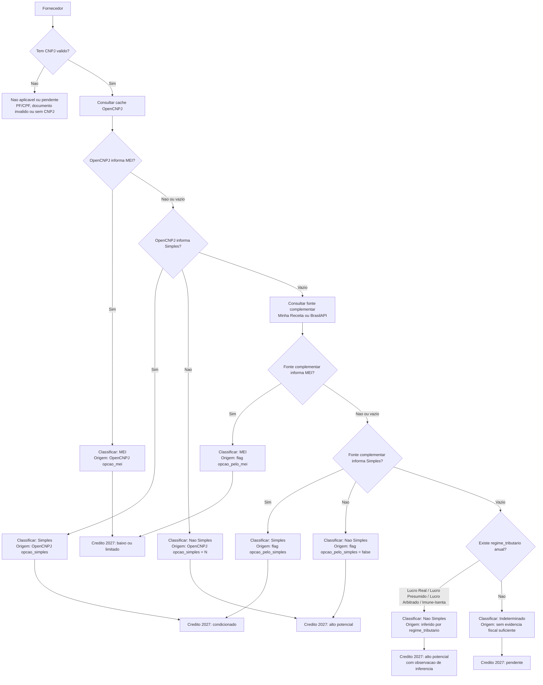

# Organograma da Logica de Regime Fiscal - Versao 08

## Objetivo da logica

Classificar cada fornecedor PJ/CNPJ em uma das quatro categorias operacionais:

- `MEI`
- `Simples`
- `Nao Simples`
- `Indeterminado`

Essa classificacao serve para apoiar a analise de potencial de credito no cenario fiscal de 2027.

Importante: a classificacao nao deve esconder a origem da evidencia. O painel deve mostrar se a conclusao veio de uma flag direta de Simples/MEI ou se foi inferida por regime tributario anual.

## Organograma

## Leitura em palavras simples

1. Primeiro eu tento resolver com o que ja temos no OpenCNPJ.
2. Se o OpenCNPJ diz `MEI`, acabou: o fornecedor e `MEI`.
3. Se o OpenCNPJ diz `Simples`, acabou: o fornecedor e `Simples`.
4. Se o OpenCNPJ diz `Nao Simples`, acabou: o fornecedor e `Nao Simples`.
5. Se o OpenCNPJ nao diz nada sobre Simples/MEI, consulto uma fonte complementar.
6. Na fonte complementar, se vier `opcao_pelo_mei = true`, classifico como `MEI`.
7. Se vier `opcao_pelo_simples = true`, classifico como `Simples`.
8. Se vier `opcao_pelo_simples = false`, classifico como `Nao Simples`.
9. Se essas flags vierem vazias, mas a fonte trouxer `regime_tributario` como `Lucro Real` ou `Lucro Presumido`, classifico como `Nao Simples`, mas marco como inferido.
10. Se nao houver nenhuma dessas evidencias, mantenho como `Indeterminado`.

## Por que regime tributario permite inferir Nao Simples?

Porque `Lucro Real`, `Lucro Presumido`, `Lucro Arbitrado` e `Imune/Isenta` sao formas de tributacao fora do Simples Nacional.

Entao, se a fonte nao informou diretamente `opcao_pelo_simples = false`, mas informou que a empresa teve regime tributario anual `Lucro Real` ou `Lucro Presumido`, a leitura operacional e:

`Nao Simples`, com origem `inferido por regime tributario`.

Essa diferenca de origem e importante e deve aparecer no painel.

## Como isso deve aparecer no 08

No painel `08`, a coluna fiscal deve separar:

- `Regime`: MEI, Simples, Nao Simples ou Indeterminado.
- `Origem`: OpenCNPJ, Minha Receita, BrasilAPI ou inferido por regime tributario.
- `Evidencia`: flag Simples/MEI, ou ultimo regime tributario conhecido.
- `Ano`: ano do regime tributario quando a classificacao for inferida.

Exemplos:

| Regime | Origem | Evidencia | Leitura de credito |
|---|---|---|---|
| MEI | Minha Receita | opcao_pelo_mei = true | baixo ou limitado |
| Simples | OpenCNPJ | opcao_simples = S | condicionado |
| Nao Simples | Minha Receita | opcao_pelo_simples = false | alto potencial |
| Nao Simples | Minha Receita | 2024: Lucro Presumido | alto potencial, inferido |
| Indeterminado | Sem evidencia | sem flags e sem regime tributario | pendente |

## Cuidados

- `Nao Simples inferido` nao deve ser escondido como se fosse flag direta.
- Se o regime tributario mais recente for 2024, o painel deve mostrar `2024`, sem afirmar automaticamente que esse e o regime atual de 2026.
- A decisao de credito final ainda depende da regra fiscal aplicavel, natureza do produto, documento fiscal, tributacao da operacao e regras de transicao da Reforma Tributaria.

