# Diagrama de layout - BI de Suprimentos

## Objetivo

Desenhar a primeira versao do `BI de Suprimentos` como uma aplicacao HTML propria, usando a linguagem visual do painel de fornecedores, mas organizada por decisoes de suprimentos.

A proposta nao e copiar todos os dashboards do Zoho. A proposta e criar uma camada nossa, com:

- visao executiva;
- detalhe acionavel;
- filtros consistentes;
- cruzamento com cadastro/regime fiscal dos fornecedores;
- filas de acao para compras, fiscal e financeiro.

## Estrutura geral

```mermaid
flowchart TD
    A[BI de Suprimentos] --> B[Resumo Executivo]
    A --> C[Fornecedor 360]
    A --> D[Oportunidades]
    A --> E[Produtos e Precos]
    A --> F[Cotacoes]
    A --> G[Inflacao e Impacto]
    A --> H[Fiscal 2027]
    A --> I[Financeiro Operacional]
    A --> J[Adiantamentos]
    A --> K[Qualidade dos Dados]

    C --> C1[Cadastro + Regime Fiscal]
    C --> C2[Compras + Curva]
    C --> C3[Produtos + UFs]
    C --> C4[CP + AD]

    D --> D1[Compra acima da menor cotacao]
    D --> D2[Curva A com inflacao]
    D --> D3[Baixa concorrencia]
    D --> D4[Fornecedor critico]

    E --> E1[PMP 0 a 12]
    E --> E2[Curva ID/Produto]
    E --> E3[Fornecedores do item]

    F --> F1[QTD_COT]
    F --> F2[MIN/MED/MAX]
    F --> F3[Fornecedor menor preco]

    H --> H1[Regime fiscal]
    H --> H2[Credito 2027]
    H --> H3[Fila fiscal por valor]
```



## Casca da aplicacao

Todos os layouts compartilham a mesma casca.

```text
+--------------------------------------------------------------------------------------+
| BI de Suprimentos                           [Busca global.........................]  |
| [Metodologia ?] [Exportar CSV] [Atualizado em: yyyy-mm-dd hh:mm]                     |
+--------------------------------------------------------------------------------------+
| Empresa | Negocio | UF | Filial | Periodo | Categoria | Curva | Regime | Alerta     |
+--------------------------------------------------------------------------------------+
| Resumo | Fornecedores | Oportunidades | Produtos | Cotacoes | Inflacao | Fiscal | ...|
+--------------------------------------------------------------------------------------+
| Conteudo da pagina selecionada                                                     |
+--------------------------------------------------------------------------------------+
```

Filtros fixos:

- `Empresa`: RC, ME, SU.
- `Negocio`: Hospital, Merenda, Cozinha, CD, Escola, Presidio, Matriz.
- `UF`.
- `Filial`.
- `Periodo`.
- `Categoria`: CAT1 a CAT5.
- `Curva`: AAA, AA, A, B, BB, C, CC, CCC.
- `Regime fiscal`.
- `Tipo de alerta`.

## Pagina 1 - Resumo Executivo

Objetivo: responder rapidamente onde esta o dinheiro, onde esta o risco e onde esta a oportunidade.

```text
+--------------------------------------------------------------------------------------+
| KPIs                                                                                |
| [Total comprado] [Fornecedores] [Produtos/IDs] [Impacto R$] [Oportunidades R$]       |
| [Compras c/ cotacao] [Fornecedores risco fiscal] [CP em aberto]                     |
+--------------------------------------------------------------------------------------+
| Tendencia mensal de compras                  | Compras por negocio                   |
| Grafico linha/coluna                         | Barras horizontais                    |
+--------------------------------------------------------------------------------------+
| Top categorias                               | Top fornecedores                      |
| Tabela compacta: CAT, valor, %, curva        | Tabela: fornecedor, valor, curva       |
+--------------------------------------------------------------------------------------+
| Alertas executivos                                                                   |
| - Curva A com inflacao alta                                                          |
| - Compra acima da menor cotacao                                                      |
| - Fornecedor alto valor com regime pendente                                          |
| - Adiantamento pendente                                                              |
+--------------------------------------------------------------------------------------+
```

Fontes:

- `NFE`
- `FAT_SUP`
- `INFLACAO`
- curvas ABC
- `COT_MIN_FORN`
- base fiscal `08b`

## Pagina 2 - Fornecedor 360

Objetivo: transformar o painel atual de fornecedores em uma visao economica, operacional e fiscal.

```text
+--------------------------------------------------------------------------------------+
| Lista de fornecedores                                                                |
| Fornecedor | CNPJ | Empresas | Curva | Valor | Regime | Credito 2027 | Alertas       |
+--------------------------------------------------------------------------------------+
| Linha expandida                                                                      |
| +-------------------+ +-------------------+ +-------------------+ +----------------+ |
| | Identidade        | | Compras           | | Fiscal 2027       | | Financeiro     | |
| | CNPJ              | | Total             | | Regime            | | CP aberto      | |
| | Razao/Fantasia    | | Curva/POS         | | Credito           | | Vencidos       | |
| | UF/Endereco       | | Categorias        | | Origem evidencia  | | AD pendente    | |
| +-------------------+ +-------------------+ +-------------------+ +----------------+ |
| +----------------------------------------------------------------------------------+ |
| | Produtos comprados                                                               | |
| | ID | Produto | Categoria | Valor | PMP atual | Menor cotacao | Impacto | Curva    | |
| +----------------------------------------------------------------------------------+ |
+--------------------------------------------------------------------------------------+
```

Campos principais:

- valor comprado;
- curva fornecedor;
- produtos/IDs atendidos;
- UFs/filiais;
- cotacoes e menor preco;
- contas a pagar;
- adiantamentos;
- regime fiscal e credito 2027;
- pendencias cadastrais.

## Pagina 3 - Oportunidades

Objetivo: gerar uma fila de acao, nao apenas diagnostico.

```text
+--------------------------------------------------------------------------------------+
| KPIs                                                                                |
| [Oportunidade total R$] [Itens] [Fornecedores] [Curva A] [Baixa cotacao]             |
+--------------------------------------------------------------------------------------+
| Matriz de prioridade                                                                 |
| Alto valor/alta confianca | Alto valor/baixa confianca | Baixo valor                 |
+--------------------------------------------------------------------------------------+
| Fila de oportunidades                                                                |
| Tipo | Prioridade | ID | Produto | Fornecedor atual | Menor cotacao | Impacto R$     |
|      | Evidencia | Acao sugerida | Status                                                |
+--------------------------------------------------------------------------------------+
| Detalhe da oportunidade                                                              |
| Historico PMP | Cotacoes | Compras recentes | Fornecedores alternativos                    |
+--------------------------------------------------------------------------------------+
```

Tipos de oportunidade:

- compra acima da menor cotacao;
- item curva A com inflacao;
- produto com apenas 1 cotacao;
- fornecedor atual nao e menor preco;
- item com alto impacto em reais;
- fornecedor alto valor com regime fiscal pendente.

## Pagina 4 - Produtos e Precos

Objetivo: investigar preco por produto/ID.

```text
+--------------------------------------------------------------------------------------+
| Busca produto/ID                                                                     |
+--------------------------------------------------------------------------------------+
| Produto | ID | Categoria | Curva ID | Curva Produto | PMP_0 | Var 12m | Impacto R$   |
+--------------------------------------------------------------------------------------+
| Linha expandida                                                                      |
| +----------------------+ +----------------------+ +-------------------------------+ |
| | PMP 0..12            | | Cotacoes             | | Fornecedores                  | |
| | mini grafico         | | min/med/max/qtd      | | atual, menor preco, historico | |
| +----------------------+ +----------------------+ +-------------------------------+ |
| | Compras por UF/filial                                                               |
| | UF | Filial | Qtde | Total | PMP | Menor cotacao | Impacto                       |
| +----------------------------------------------------------------------------------+ |
+--------------------------------------------------------------------------------------+
```

Fontes:

- `NFE`
- `PMP_ID_INF_12`
- `PMP_PROD_INF_12`
- `NUM_COT`
- `COT_MIN_FORN`
- `CURVA ID - TODAS`
- `CURVA PROD - TODAS`

## Pagina 5 - Cotacoes

Objetivo: medir disciplina de cotacao e competitividade.

```text
+--------------------------------------------------------------------------------------+
| KPIs                                                                                |
| [Produtos cotados] [Media cotacoes/produto] [Itens com 1 cotacao] [Sem cotacao]      |
+--------------------------------------------------------------------------------------+
| Distribuicao QTD_COT                                                                 |
| 1 cotacao | 2 cotacoes | 3 cotacoes | 4+ cotacoes                                    |
+--------------------------------------------------------------------------------------+
| Tabela                                                                               |
| ID | Produto | Mes | UF | Empresa | QTD_COT | MIN | MED | MAX | Forn menor preco     |
+--------------------------------------------------------------------------------------+
| Detalhe                                                                              |
| Lista de fornecedores cotados, preco unitario, curva fornecedor, compra realizada     |
+--------------------------------------------------------------------------------------+
```

Medidas:

- `QTD_COT`;
- `MIN_COT`;
- `MED_COT`;
- `MAX_COT`;
- `FORN_MENOR_PRECO`;
- `CNPJ_MENOR_PRECO`;
- comparativo com compra real.

## Pagina 6 - Inflacao e Impacto

Objetivo: explicar aumentos e perdas em reais.

```text
+--------------------------------------------------------------------------------------+
| KPIs                                                                                |
| [Impacto total] [Inflacao media] [Top inflacao] [Top deflacao] [Itens afetados]      |
+--------------------------------------------------------------------------------------+
| Ranking impacto em R$                         | Ranking variacao %                  |
+--------------------------------------------------------------------------------------+
| Tabela                                                                               |
| ID | Produto | Categoria | Mes | PMP_0 | PMP_1 | PMP_12 | INF_ID | IMP_ID | Curva    |
+--------------------------------------------------------------------------------------+
| Detalhe                                                                              |
| Serie PMP 12 meses | Compras no periodo | Cotacoes | Fornecedores                   |
+--------------------------------------------------------------------------------------+
```

Fontes:

- `INFLACAO`
- `PMP_ID_INF_12`
- `PMP_PROD_INF_12`
- `NFE`

## Pagina 7 - Fiscal 2027

Objetivo: priorizar analise fiscal por impacto economico.

```text
+--------------------------------------------------------------------------------------+
| KPIs                                                                                |
| [Compras Nao Simples] [Simples] [MEI] [Indeterminado] [Credito alto] [Pendente]      |
+--------------------------------------------------------------------------------------+
| Compras por regime                         | Compras por potencial de credito       |
+--------------------------------------------------------------------------------------+
| Fila fiscal                                                                        |
| Fornecedor | CNPJ | Valor comprado | Curva | Regime | Credito | Origem | Acao        |
+--------------------------------------------------------------------------------------+
| Detalhe                                                                            |
| Evidencia fiscal | Cadastro | Produtos comprados | Filiais | Cotacoes | CP           |
+--------------------------------------------------------------------------------------+
```

Fontes:

- `output/08_regime_fiscal/11_fornecedores_08b_auditoria_simplificada.csv`
- `NFE`
- curvas de fornecedor

## Pagina 8 - Financeiro Operacional

Objetivo: conectar suprimentos com contas a pagar.

```text
+--------------------------------------------------------------------------------------+
| KPIs                                                                                |
| [Saldo aberto] [Vencido] [A vencer 7d] [Pago semana] [Fornecedores criticos]         |
+--------------------------------------------------------------------------------------+
| Evolucao semanal de saldo                   | Entradas x baixas                     |
+--------------------------------------------------------------------------------------+
| Fornecedores                                                                            |
| Fornecedor | Saldo | Vencido | A vencer | Compras | Curva | Criticidade              |
+--------------------------------------------------------------------------------------+
| Detalhe fornecedor                                                                      |
| Historico CP | Notas | Compras | Fiscal | Contatos                                |
+--------------------------------------------------------------------------------------+
```

Fontes:

- `CP`
- `CP_MOV`
- `CP_SEMANA`
- `CP_SALDO_2025`
- `CP_SALDO_2026`
- `NFE`

## Pagina 9 - Adiantamentos

Objetivo: acompanhar nota x adiantamento.

```text
+--------------------------------------------------------------------------------------+
| KPIs                                                                                |
| [Valor AD] [Conciliado] [Pendente] [Divergente] [Fornecedores]                       |
+--------------------------------------------------------------------------------------+
| AD por mes entrada                         | AD por mes pagamento                    |
+--------------------------------------------------------------------------------------+
| Tabela                                                                               |
| Fornecedor | Produto | Filial | Mes entrada | Mes pgto | Valor | Status conciliacao   |
+--------------------------------------------------------------------------------------+
| Detalhe                                                                              |
| Nota | AD | Quantidade | Valor conciliado | Historico fornecedor                    |
+--------------------------------------------------------------------------------------+
```

Fontes:

- `AD_v3`
- `ADIANTAMENTO_NFE`
- `NF ADT - IDEAL`
- `NF ADT - MELHOR`
- `NF ADT - POMME VITA`

## Pagina 10 - Qualidade dos Dados

Objetivo: garantir confianca no BI.

```text
+--------------------------------------------------------------------------------------+
| Status geral                                                                         |
| [Fontes OK] [Colunas OK] [Mes recente OK] [Chaves nulas] [Quedas de volume]          |
+--------------------------------------------------------------------------------------+
| Fontes monitoradas                                                                   |
| Fonte | Linhas atuais | Linhas anteriores | Ultimo mes | Colunas | Status             |
+--------------------------------------------------------------------------------------+
| Testes                                                                               |
| - NFE exporta                                                                        |
| - Colunas obrigatorias presentes                                                     |
| - Fornecedor nao nulo                                                                |
| - Produto nao nulo                                                                   |
| - Mes recente existe                                                                 |
| - Ponte fornecedor x cadastro                                                        |
+--------------------------------------------------------------------------------------+
```

Fontes:

- inventario Zoho;
- perfil das fontes;
- exports locais;
- marts gerados.

## Layout de navegacao recomendado

```text
Resumo
  -> clicar fornecedor leva para Fornecedor 360
  -> clicar produto leva para Produtos e Precos
  -> clicar oportunidade leva para Oportunidades

Fornecedor 360
  -> abre detalhe fiscal
  -> abre produtos comprados
  -> abre CP/AD

Produtos e Precos
  -> abre cotacoes
  -> abre fornecedores
  -> abre inflacao

Oportunidades
  -> abre evidencia
  -> exporta fila CSV
  -> status: novo / em analise / negociado / descartado
```

## Componentes visuais

### Tags

- Curva: `AAA`, `AA`, `A`, `B`, `BB`, `C`, `CC`, `CCC`.
- Regime: `Nao Simples`, `Simples`, `MEI`, `Indeterminado`.
- Credito: `Alto`, `Condicionado`, `Baixo`, `Pendente`.
- Oportunidade: `Preco`, `Cotacao`, `Inflacao`, `Fiscal`, `CP`, `AD`.
- Status: `Novo`, `Em analise`, `Validado`, `Descartado`.

### KPIs fixos

- Total comprado.
- Impacto em R$.
- Oportunidade estimada.
- Fornecedores ativos.
- Produtos/IDs ativos.
- Compras com cotacao.
- CP aberto.
- AD pendente.

### Acoes

- Copiar CNPJ/codigo.
- Exportar CSV filtrado.
- Abrir detalhe.
- Ver evidencia.
- Marcar status da oportunidade.

## Primeira versao sugerida

Para sair rapido e com valor alto:

1. `Resumo Executivo`.
2. `Fornecedor 360`.
3. `Oportunidades`.
4. `Produtos e Precos`.
5. `Fiscal 2027`.

As demais paginas entram depois:

- `Cotacoes`;
- `Inflacao`;
- `Financeiro Operacional`;
- `Adiantamentos`;
- `Qualidade dos Dados`.

